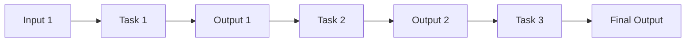

# 🧠 Workflows & Tasks with LLM
## Full Day Hands-on Workshop
### การออกแบบ AI Workflow อย่างมีประสิทธิภาพ

#### โดย อิสมันต์ แสงบำรุง 
#### Technical Incubator at The Tiger team academy


---

# เนื้อหาที่จะเรียนรู้วันนี้

<div class="columns">
<div>

## 🎯 หัวข้อหลัก
- **Introduction:** ทำไมต้องมี AI Workflow
- **Prompt Types:** Prompt ตามประเภทของ Task
- **Workflow Design:** การออกแบบ Prompt Workflow
- **Structured Output:** เพื่อ Workflow ที่ต่อเนื่อง

</div>
<div>

## 🛠️ กิจกรรมปฏิบัติ
- **Workshop:** สร้าง AI Workflow ของคุณ
- **Showcase:** นำเสนอผลงาน
- **Feedback:** รับฟังข้อเสนอแนะ
- **Templates:** รับ Prompt & Workflow Template

</div>
</div>

---

# 1. Introduction: ทำไมต้องมี AI Workflow

## 1.1 ความแตกต่างระหว่าง Prompt เดียว vs Prompt Workflow

<div class="columns">
<div>

### 🔸 Prompt เดียว
```
เขียนแผนการตลาดสำหรับร้านกาแฟ
```

**ผลลัพธ์:**
- ได้คำตอบทั่วไป
- ไม่ละเอียด
- ไม่ครอบคลุม
- ต้องถามซ้ำหลายครั้ง

</div>
<div>

### 🔸 Prompt Workflow
```
Task 1: วิเคราะห์กลุ่มเป้าหมาย
Task 2: วิเคราะห์คู่แข่ง
Task 3: กำหนดกลยุทธ์
Task 4: สร้างแผนการตลาด
Task 5: กำหนดงบประมาณ
```

**ผลลัพธ์:**
- ได้คำตอบที่ละเอียด
- มีโครงสร้างชัดเจน
- ครอบคลุมทุกมิติ
- ใช้งานได้จริง

</div>
</div>

---

## 1.2 แนวคิด: งานคือชุดของ Task ที่ต่อกัน

<div class="workflow-box">

### 🔄 Input → Process → Output Chain



</div>

### ตัวอย่าง: การเขียนบทความ

<div class="columns">
<div>

**🎯 งาน:** เขียนบทความรีวิวร้านอาหาร

**📋 Task ที่แยกออกมา:**
1. วิเคราะห์ร้านอาหาร
2. สรุปจุดเด่น-จุดด้อย
3. เขียนบทความ
4. ตรวจสอบและปรับปรุง

</div>
<div>

**✅ ประโยชน์:**
- แต่ละ Task มีจุดประสงค์ชัดเจน
- ผลลัพธ์มีคุณภาพสูง
- ควบคุมได้ทุกขั้นตอน
- สามารถปรับปรุงได้ง่าย

</div>
</div>

---

## 1.3 ตัวอย่างงานที่เหมาะกับการใช้ AI Workflow

<div class="columns">
<div>

### 📊 การวิเคราะห์ข้อมูล
- วิเคราะห์ยอดขาย
- สรุปรายงานการประชุม
- วิเคราะห์ฟีดแบ็กลูกค้า

### 📝 การเขียนเนื้อหา
- เขียนบทความ
- สร้างคอนเทนต์โซเชียล
- เขียนอีเมลการตลาด

</div>
<div>

### 🎯 การวางแผน
- วางแผนโครงการ
- สร้างแผนการตลาด
- วางแผนการเรียน

### 🔍 การวิจัย
- รวบรวมข้อมูล
- วิเคราะห์แนวโน้ม
- สรุปผลการวิจัย

</div>
</div>

---

## 1.4 กิจกรรม: แบ่งงานออกเป็นขั้นตอน Input → Process → Output

### 🎯 กิจกรรมที่ 1: ฝึกแยก Task

**สถานการณ์:** คุณต้องเตรียมการนำเสนอขายผลิตภัณฑ์ใหม่

<div class="task-box">

**✏️ ให้แยกงานนี้เป็น Task ย่อย ๆ อย่างน้อย 5 ขั้นตอน**

1. ___________________________________
2. ___________________________________
3. ___________________________________
4. ___________________________________
5. ___________________________________

</div>

**⏰ เวลา:** 10 นาที | **👥 รูปแบบ:** ทำเป็นกลุ่ม 3-4 คน

---

# 2. Prompt ตามประเภทของ Task

## 2.1 การวิเคราะห์ (Analyze)

<div class="columns">
<div>

### 🔍 ลักษณะของ Task วิเคราะห์
- แยกแยะข้อมูล
- หาความสัมพันธ์
- ระบุปัญหาและสาเหตุ
- ประเมินผลกระทบ

### 📝 โครงสร้าง Prompt
```
วิเคราะห์ [ข้อมูล/สถานการณ์] โดย:
1. ระบุประเด็นหลัก
2. หาสาเหตุ
3. ประเมินผลกระทบ
4. ข้อเสนอแนะ
```

</div>
<div>

### ✅ ตัวอย่าง Prompt ที่ดี

```
วิเคราะห์ยอดขายที่ลดลง 20% ในเดือนที่ผ่านมา:

ข้อมูล: [แนบข้อมูลยอดขาย]

กรุณาวิเคราะห์:
1. ระบุปัจจัยที่ทำให้ยอดขายลดลง
2. เปรียบเทียบกับช่วงเดียวกันปีที่แล้ว
3. ผลกระทบต่อธุรกิจ
4. แนวทางแก้ไขที่เป็นไปได้

รูปแบบ: ตาราง + สรุปย่อ
```

</div>
</div>

---

## 2.2 การสรุป (Summarize)

<div class="columns">
<div>

### 📋 ลักษณะของ Task สรุป
- ดึงใจความสำคัญ
- ลดความซับซ้อน
- เน้นจุดสำคัญ
- ทำให้เข้าใจง่าย

### 📏 ระดับการสรุป
- **Executive Summary:** สรุปสำหรับผู้บริหาร
- **Technical Summary:** สรุปเทคนิค
- **Quick Summary:** สรุปแบบย่อ

</div>
<div>

### ✅ ตัวอย่าง Prompt ที่ดี

```
สรุปรายงานการประชุมต่อไปนี้:

[แนบเอกสารการประชุม]

กรุณาสรุปในรูปแบบ:
1. ประเด็นหลักที่หารือ (3 ข้อ)
2. มติที่ได้ (หากมี)
3. Action Items พร้อมผู้รับผิดชอบ
4. วันนัดประชุมครั้งถัดไป

ความยาว: ไม่เกิน 200 คำ
กลุ่มเป้าหมาย: ผู้บริหารระดับสูง
```

</div>
</div>

---

## 2.3 การสังเคราะห์/จัดกลุ่มข้อมูล (Synthesize)

<div class="columns">
<div>

### 🔗 ลักษณะของ Task สังเคราะห์
- รวมข้อมูลจากหลายแหล่ง
- หาความเชื่อมโยง
- สร้างมุมมองใหม่
- จัดกลุ่มตามหลักเกณฑ์

### 🎯 เป้าหมาย
- ได้ข้อมูลที่สมบูรณ์
- เห็นภาพรวม
- เข้าใจความสัมพันธ์

</div>
<div>

### ✅ ตัวอย่าง Prompt ที่ดี

```
สังเคราะห์ข้อมูลจากแหล่งต่อไปนี้:
- รายงานการวิจัยตลาด A
- สถิติพฤติกรรมผู้บริโภค B  
- เทรนด์อุตสาหกรรม C

จัดกลุ่มข้อมูลตาม:
1. โอกาสทางธุรกิจ
2. ความเสี่ยง
3. แนวโน้มในอนาคต

สร้างสรุปภาพรวม 1 หน้า พร้อม
แนวทางการดำเนินงาน 3 ข้อ
```

</div>
</div>

---

## 2.4 การสร้างใหม่ (Generate)

<div class="columns">
<div>

### ✨ ลักษณะของ Task สร้างใหม่
- สร้างเนื้อหาใหม่
- คิดไอเดียสร้างสรรค์
- ออกแบบแนวทาง
- พัฒนาแนวคิด

### 🎨 ประเภทการสร้าง
- **Creative:** สร้างสรรค์
- **Strategic:** เชิงกลยุทธ์
- **Technical:** เชิงเทคนิค
- **Content:** เนื้อหา

</div>
<div>

### ✅ ตัวอย่าง Prompt ที่ดี

```
สร้างแคมเปญการตลาดสำหรับ:
ผลิตภัณฑ์: แอปฟิตเนสใหม่
กลุ่มเป้าหมาย: คนทำงานวัย 25-35 ปี
งบประมาณ: 500,000 บาท
ระยะเวลา: 3 เดือน

สร้าง:
1. แนวคิดหลัก (Big Idea)
2. สโลแกน 3 ตัวเลือก
3. ช่องทางการตลาด 5 ช่องทาง
4. Timeline การดำเนินงาน
5. วิธีวัดผล (KPIs)
```

</div>
</div>

---

## 2.5 ตัวอย่าง Prompt แต่ละประเภท

<div class="workflow-box">

### 🔍 Analyze Prompt Template
```
วิเคราะห์ [หัวข้อ/ข้อมูล] โดย:
- ข้อมูลพื้นฐาน: [ระบุข้อมูล]
- มุมมองที่ต้องการ: [ระบุมุมมอง]
- รูปแบบผลลัพธ์: [ระบุรูปแบบ]
- เป้าหมายการใช้งาน: [ระบุเป้าหมาย]
```

### 📋 Summarize Prompt Template
```
สรุป [เอกสาร/เนื้อหา] ในรูปแบบ:
- ความยาว: [ระบุจำนวนคำ]
- กลุ่มเป้าหมาย: [ระบุผู้อ่าน]
- จุดเน้น: [ระบุสิ่งที่ต้องเน้น]
- รูปแบบ: [bullet points/paragraph/table]
```

</div>

---

<div class="workflow-box">

### 🔗 Synthesize Prompt Template
```
สังเคราะห์ข้อมูลจาก [แหล่งข้อมูล] โดย:
- เกณฑ์การจัดกลุ่ม: [ระบุเกณฑ์]
- มุมมองที่ต้องการ: [ระบุมุมมอง]
- ความเชื่อมโยงที่หา: [ระบุความสัมพันธ์]
- ผลลัพธ์ที่ต้องการ: [ระบุผลลัพธ์]
```

### ✨ Generate Prompt Template
```
สร้าง [สิ่งที่ต้องการ] สำหรับ:
- วัตถุประสงค์: [ระบุจุดประสงค์]
- กลุ่มเป้าหมาย: [ระบุกลุ่มเป้าหมาย]
- ข้อจำกัด: [ระบุข้อจำกัด]
- เกณฑ์ความสำเร็จ: [ระบุเกณฑ์]
```

</div>

---

## 2.6 กิจกรรม: เขียน Prompt สำหรับ Task แต่ละประเภท

### 🎯 กิจกรรมที่ 2: ฝึกเขียน Prompt

<div class="task-box">

**สถานการณ์:** ร้านเบเกอรี่ต้องการเพิ่มยอดขาย

**✏️ เขียน Prompt สำหรับแต่ละ Task:**

**1. Analyze Task:**
___________________________________________________

**2. Summarize Task:**
___________________________________________________

**3. Synthesize Task:**
___________________________________________________

**4. Generate Task:**
___________________________________________________

</div>

**⏰ เวลา:** 15 นาที | **👥 รูปแบบ:** ทำเป็นคู่

---

# 3. การออกแบบ Prompt Workflow

## 3.1 การเชื่อมโยงผลลัพธ์จาก Task หนึ่งไป Task ถัดไป

<div class="columns">
<div>

### 🔗 หลักการเชื่อมโยง
- **Output ของ Task 1** = **Input ของ Task 2**
- ใช้ข้อมูลจากขั้นก่อนหน้า
- สร้างความต่อเนื่อง
- เพิ่มความลึกในการวิเคราะห์

### 📊 ตัวอย่างการเชื่อมโยง
```
Task 1: วิเคราะห์ปัญหา
↓ (ผลลัพธ์: รายการปัญหา)
Task 2: หาสาเหตุของแต่ละปัญหา
↓ (ผลลัพธ์: สาเหตุรากฐาน)
Task 3: เสนอแนวทางแก้ไข
```

</div>
<div>

### ✅ ตัวอย่าง Workflow

**Task 1: Analyze**
```
วิเคราะห์ข้อมูลยอดขายของร้าน
ผลลัพธ์: รายงานการวิเคราะห์
```

**Task 2: Synthesize**
```
นำผลการวิเคราะห์จาก Task 1 
มาสังเคราะห์หาจุดอ่อนหลัก
ผลลัพธ์: รายการจุดอ่อนที่สำคัญ
```

**Task 3: Generate**
```
ใช้รายการจุดอ่อนจาก Task 2
สร้างแผนปรับปรุง
ผลลัพธ์: แผนการปรับปรุง
```

</div>
</div>

---

## 3.2 การใช้ Output จากรอบก่อนมาเป็น Input ของรอบถัดไป

### 🔄 เทคนิคการส่งต่อข้อมูล

<div class="workflow-box">

### 1. การอ้างอิงโดยตรง
```
Task 2 Prompt:
"จากผลการวิเคราะห์ในขั้นตอนก่อนหน้า ที่ระบุว่า [คัดลอกผลลัพธ์จาก Task 1]
กรุณาสังเคราะห์ข้อมูลเพื่อ..."
```

### 2. การใช้ Structured Output
```
Task 1 Output (JSON):
{
  "problems": ["ปัญหา A", "ปัญหา B"],
  "impact": ["ผลกระทบ X", "ผลกระทบ Y"]
}

Task 2 Input:
"จากข้อมูล JSON ข้างต้น ให้สร้างแผนแก้ไข..."
```

</div>

---

### 📝 ตัวอย่าง Workflow จริง: การสร้างแผนการตลาด

<div class="columns">
<div>

**Task 1: Market Analysis**
```
วิเคราะห์ตลาด [ผลิตภัณฑ์] โดย:
1. ขนาดตลาด
2. คู่แข่งหลัก
3. กลุ่มเป้าหมาย
4. แนวโน้ม

รูปแบบ: JSON
```

**Task 2: Strategy Development**
```
จากผลการวิเคราะห์ตลาดข้างต้น
สร้างกลยุทธ์การตลาดโดย:
1. เลือกกลุ่มเป้าหมายหลัก
2. กำหนด Positioning
3. เลือกช่องทางการตลาด

ใช้ข้อมูลจาก Task 1 ในการตัดสินใจ
```

</div>
<div>

**Task 3: Campaign Creation**
```
จากกลยุทธ์ที่กำหนดใน Task 2
สร้างแคมเปญการตลาดโดย:
1. Big Idea ที่สอดคล้องกับ Positioning
2. Key Messages สำหรับกลุ่มเป้าหมาย
3. Creative Concept
4. Media Plan ตามช่องทางที่เลือก

อ้างอิงข้อมูลจาก Task 1 และ 2
```

**Task 4: Budget & Timeline**
```
จากแผนแคมเปญใน Task 3
สร้างงบประมาณและไทม์ไลน์:
1. แบ่งงบตามช่องทาง
2. กำหนดระยะเวลาแต่ละกิจกรรม
3. Milestone สำคัญ
4. KPIs การวัดผล
```

</div>
</div>

---

## 3.3 การวางลำดับ Prompt แบบมีโครงสร้าง

### 🏗️ โครงสร้าง Workflow ที่มีประสิทธิภาพ

<div class="workflow-box">

### 1. Foundation Tasks (ขั้นพื้นฐาน)
- **Research:** รวบรวมข้อมูล
- **Analyze:** วิเคราะห์ข้อมูล
- **Understand:** เข้าใจปัญหา/สถานการณ์

### 2. Processing Tasks (ขั้นประมวลผล)
- **Synthesize:** สังเคราะห์ข้อมูล
- **Evaluate:** ประเมินทางเลือก
- **Prioritize:** จัดลำดับความสำคัญ

### 3. Output Tasks (ขั้นผลลัพธ์)
- **Generate:** สร้างแนวทางแก้ไข
- **Plan:** วางแผนดำเนินงาน
- **Present:** จัดรูปแบบการนำเสนอ

</div>

---

### 📋 Template สำหรับ Workflow Design

<div class="columns">
<div>

### 🎯 Planning Phase
```
1. กำหนดเป้าหมายสุดท้าย
2. แยกเป้าหมายเป็น Sub-goals
3. ระบุ Input ที่ต้องการ
4. กำหนดลำดับ Tasks
5. ระบุจุดเชื่อมต่อ
```

### 🔍 Validation Phase
```
1. ตรวจสอบความต่อเนื่อง
2. ทดสอบแต่ละ Task
3. ปรับปรุง Prompts
4. ทดสอบ End-to-End
5. จัดทำเอกสาร
```

</div>
<div>

### ✅ Best Practices
- **เริ่มจากง่ายไปยาก**
- **แต่ละ Task มีจุดประสงค์ชัดเจน**
- **ระบุ Input/Output ที่ชัดเจน**
- **มี Fallback Plan กรณีผิดพลาด**
- **ทดสอบทีละ Task ก่อน**

### ❌ สิ่งที่ควรหลีกเลี่ยง
- Task ที่ซับซ้อนเกินไป
- การกระโดดข้าม Logic
- Output ที่ไม่ชัดเจน
- การไม่ทดสอบ

</div>
</div>

---

## 3.4 กิจกรรม: ออกแบบ Prompt Workflow 3-5 ขั้นตอน

### 🎯 กิจกรรมที่ 3: ออกแบบ Workflow

<div class="task-box">

**สถานการณ์:** บริษัทต้องการเปิดสาขาใหม่

**✏️ ออกแบบ Workflow 5 ขั้นตอน:**

**Task 1:** ___________________________________
**Input:** ___________________________________
**Output:** ___________________________________

**Task 2:** ___________________________________
**Input:** ___________________________________
**Output:** ___________________________________

**Task 3:** ___________________________________
**Input:** ___________________________________
**Output:** ___________________________________

</div>

**⏰ เวลา:** 20 นาที | **👥 รูปแบบ:** ทำเป็นกลุ่ม 4-5 คน

---

# 4. Structured Output เพื่อ Workflow ที่ต่อเนื่อง

## 4.1 การใช้ System Prompt เพื่อควบคุมผลลัพธ์

<div class="columns">
<div>

### 🎛️ System Prompt คืออะไร?
- คำสั่งที่กำหนดพฤติกรรมของ AI
- ควบคุมรูปแบบการตอบ
- สร้างความสม่ำเสมอ
- กำหนดบทบาทและกรอบการทำงาน

### 🔧 วิธีการใช้งาน
```
System: คุณคือผู้เชี่ยวชาญการวิเคราะห์ธุรกิจ
ตอบทุกคำถามในรูปแบบ JSON เสมอ
ใช้ภาษาไทยในการอธิบาย
ระบุแหล่งข้อมูลที่ใช้ในการวิเคราะห์
```

</div>
<div>

### ✅ ตัวอย่าง System Prompt ที่ดี

```
System Prompt:
คุณคือ AI Assistant ที่เชี่ยวชาญด้าน
การวิเคราะห์ธุรกิจ

กฎการทำงาน:
1. ตอบเป็นภาษาไทยเสมอ
2. ใช้รูปแบบ JSON สำหรับข้อมูลที่มีโครงสร้าง
3. แสดงความมั่นใจในคำตอบ (0-100%)
4. ระบุข้อจำกัดของการวิเคราะห์
5. เสนอคำถามเพิ่มเติมหากข้อมูลไม่เพียงพอ

รูปแบบการตอบ:
- วิเคราะห์: ใช้หัวข้อชัดเจน
- ข้อเสนอแนะ: ให้เหตุผลประกอบ
- ข้อมูล: อ้างอิงแหล่งที่มา
```

</div>
</div>

---

## 4.2 รูปแบบ Output: JSON, Markdown, Bullet, Table

### 📊 JSON Format

<div class="columns">
<div>

**ใช้เมื่อไหร่:**
- ต้องการข้อมูลที่มีโครงสร้าง
- ต้องนำไปประมวลผลต่อ
- ต้องการความแม่นยำสูง

**ตัวอย่าง:**
```json
{
  "analysis": {
    "strengths": ["จุดแข็ง 1", "จุดแข็ง 2"],
    "weaknesses": ["จุดอ่อน 1", "จุดอ่อน 2"],
    "opportunities": ["โอกาส 1", "โอกาส 2"],
    "threats": ["ภัยคุกคาม 1", "ภัยคุกคาม 2"]
  },
  "confidence": 85,
  "next_steps": ["ขั้นตอน 1", "ขั้นตอน 2"]
}
```

</div>
<div>

### 📝 Markdown Format

**ใช้เมื่อไหร่:**
- ต้องการเอกสารที่อ่านง่าย
- ต้องการจัดรูปแบบ
- ต้องการแชร์หรือนำเสนอ

**ตัวอย่าง:**
```markdown
# การวิเคราะห์ SWOT

## จุดแข็ง (Strengths)
- จุดแข็ง 1
- จุดแข็ง 2

## จุดอ่อน (Weaknesses)
- จุดอ่อน 1
- จุดอ่อน 2

## ข้อเสนอแนะ
1. แนวทางที่ 1
2. แนวทางที่ 2
```

</div>
</div>

---

### 📋 Bullet Points & Table Format

<div class="columns">
<div>

### 🔸 Bullet Points
**ใช้เมื่อไหร่:**
- ต้องการความเรียบง่าย
- รายการที่ไม่ซับซ้อน
- ต้องการอ่านเร็ว

**ตัวอย่าง:**
```
ปัจจัยความสำเร็จ:
• ทีมงานที่มีประสบการณ์
• งบประมาณเพียงพอ
• การสนับสนุนจากผู้บริหาร
• ระบบเทคโนโลยีที่ทันสมัย

ความเสี่ยง:
• การเปลี่ยนแปลงของตลาด
• การแข่งขันที่รุนแรง
• ข้อจำกัดด้านงบประมาณ
```

</div>
<div>

### 📊 Table Format
**ใช้เมื่อไหร่:**
- ต้องการเปรียบเทียบ
- ข้อมูลที่มีหลายมิติ
- ต้องการความชัดเจน

**ตัวอย่าง:**
```
| กิจกรรม | ระยะเวลา | งบประมาณ | ผู้รับผิดชอบ |
|---------|----------|-----------|-------------|
| วิจัยตลาด | 2 สัปดาห์ | 50,000 | ทีม A |
| ออกแบบ | 3 สัปดาห์ | 100,000 | ทีม B |
| ทดสอบ | 1 สัปดาห์ | 30,000 | ทีม C |
```

</div>
</div>

---

## 4.3 ตัวอย่างการใช้ Structured Output เพื่อเชื่อม Task

### 🔗 Workflow Example: การวิเคราะห์ลูกค้า

<div class="workflow-box">

**Task 1: Customer Analysis (JSON Output)**
```
Prompt: วิเคราะห์ข้อมูลลูกค้า โดยให้ผลลัพธ์เป็น JSON

Output:
{
  "customer_segments": [
    {
      "name": "กลุ่มวัยทำงาน",
      "age_range": "25-40",
      "characteristics": ["มีรายได้สม่ำเสมอ", "ใช้เทคโนโลยี"],
      "pain_points": ["ขาดเวลา", "ต้องการความสะดวก"],
      "size": "40%"
    }
  ],
  "key_insights": ["ลูกค้าต้องการความรวดเร็ว", "ให้ความสำคัญกับคุณภาพ"]
}
```

</div>

---

<div class="workflow-box">

**Task 2: Strategy Development (Markdown Output)**
```
Prompt: จากข้อมูลลูกค้าในรูปแบบ JSON ข้างต้น สร้างกลยุทธ์การตลาด
ให้ผลลัพธ์เป็น Markdown

Output:
# กลยุทธ์การตลาดสำหรับกลุ่มวัยทำงาน

## เป้าหมาย
- เพิ่มยอดขายในกลุ่มนี้ 30%
- สร้างความผูกพันกับแบรนด์

## กลยุทธ์หลัก
1. **Convenience Strategy**: เน้นความสะดวกรวดเร็ว
2. **Quality Assurance**: รับประกันคุณภาพ
3. **Digital First**: ใช้ช่องทางดิจิทัลเป็นหลัก

## แผนการดำเนินงาน
- Phase 1: ปรับปรุงระบบออนไลน์
- Phase 2: เปิดตัวแอปพลิเคชัน
- Phase 3: แคมเปญการตลาดดิจิทัล
```

</div>

---

## 4.4 กิจกรรม: ปรับ Prompt ให้ออก Structured Output

### 🎯 กิจกรรมที่ 4: ฝึกใช้ Structured Output

<div class="task-box">

**สถานการณ์:** วิเคราะห์ความพึงพอใจของลูกค้า

**✏️ เขียน Prompt ให้ได้ Structured Output:**

**1. JSON Output Prompt:**
___________________________________________________
___________________________________________________

**2. Markdown Output Prompt:**
___________________________________________________
___________________________________________________

**3. Table Output Prompt:**
___________________________________________________
___________________________________________________

</div>

**⏰ เวลา:** 15 นาที | **👥 รูปแบบ:** ทำเป็นคู่

---

# 5. Workshop: สร้าง AI Workflow ของคุณ

## 5.1 เลือกงานที่ทำซ้ำบ่อยของตนเอง

### 🎯 การเลือกงานที่เหมาะสม

<div class="columns">
<div>

### ✅ งานที่เหมาะกับ AI Workflow
- ทำซ้ำบ่อย (อย่างน้อยสัปดาห์ละครั้ง)
- มีขั้นตอนที่ชัดเจน
- ใช้การคิดวิเคราะห์
- ต้องการความสม่ำเสมอ
- สามารถแบ่งเป็น Tasks ย่อยได้

### 📝 ตัวอย่างงานที่เหมาะสม
- เขียนรายงานประจำสัปดาห์
- วิเคราะห์ยอดขาย
- สร้างคอนเทนต์โซเชียล
- วางแผนการประชุม
- ตอบอีเมลลูกค้า

</div>
<div>

### ❌ งานที่ไม่เหมาะสม
- ต้องการการตัดสินใจที่ซับซ้อน
- เกี่ยวข้องกับข้อมูลส่วนบุคคล
- ต้องการการโต้ตอบแบบ Real-time
- ไม่มีรูปแบบที่ชัดเจน

### 🤔 คำถามช่วยเลือก
1. งานนี้ทำบ่อยแค่ไหน?
2. ใช้เวลานานเท่าไหร่?
3. มีขั้นตอนที่ซ้ำกันไหม?
4. ผลลัพธ์มีรูปแบบคล้ายกันไหม?
5. สามารถอธิบายขั้นตอนให้คนอื่นฟังได้ไหม?

</div>
</div>

---

### 📋 แบบประเมินงานสำหรับ AI Workflow

<div class="task-box">

**✏️ ประเมินงานของคุณ (ให้คะแนน 1-5)**

| เกณฑ์ | คะแนน | หมายเหตุ |
|-------|-------|----------|
| ความถี่ในการทำงาน (5 = ทุกวัน, 1 = เดือนละครั้ง) | ___ | |
| ความซับซ้อนที่เหมาะสม (5 = พอดี, 1 = ง่าย/ยากเกินไป) | ___ | |
| ความชัดเจนของขั้นตอน (5 = ชัดมาก, 1 = คลุมเครือ) | ___ | |
| ความสม่ำเสมอของผลลัพธ์ (5 = เหมือนเสมอ, 1 = แตกต่างมาก) | ___ | |
| ประโยชน์ที่คาดว่าจะได้ (5 = มาก, 1 = น้อย) | ___ | |

**รวมคะแนน: ___/25**

**เกณฑ์:** 20+ = เหมาะมาก, 15-19 = เหมาะสม, <15 = ควรเลือกงานอื่น

</div>

---

## 5.2 แยกขั้นตอนและเขียน Prompt สำหรับแต่ละขั้น

### 🔧 เทคนิคการแยกขั้นตอน

<div class="workflow-box">

### 1. Mind Mapping
- เขียนเป้าหมายหลักตรงกลาง
- แยกเป็นขั้นตอนใหญ่
- แยกย่อยเป็น Sub-tasks
- หาความเชื่อมโยงระหว่างขั้นตอน

### 2. Process Flow
- เริ่มจาก Input
- ระบุการประมวลผลแต่ละขั้น
- กำหนด Output ของแต่ละขั้น
- ตรวจสอบความต่อเนื่อง

### 3. User Story Mapping
- กำหนด User Journey
- ระบุ Pain Points
- แยกเป็น Epic และ Story
- จัดลำดับความสำคัญ

</div>

---

### 📝 Template การแยกขั้นตอน

<div class="columns">
<div>

### 🎯 ขั้นตอนที่ 1: วิเคราะห์งาน
```
งานที่เลือก: ________________

เป้าหมายหลัก: ________________

Input ที่ต้องการ:
- ________________
- ________________
- ________________

Output ที่ต้องการ:
- ________________
- ________________
- ________________
```

</div>
<div>

### 🔧 ขั้นตอนที่ 2: แยก Tasks
```
Task 1: ________________
- Input: ________________
- Process: ________________
- Output: ________________

Task 2: ________________
- Input: ________________
- Process: ________________
- Output: ________________

Task 3: ________________
- Input: ________________
- Process: ________________
- Output: ________________
```

</div>
</div>

---

### ✅ ตัวอย่าง: การสร้างรายงานยอดขายประจำสัปดาห์

<div class="workflow-box">

**Task 1: Data Collection & Analysis**
```
Prompt: วิเคราะห์ข้อมูลยอดขายสัปดาห์นี้:

ข้อมูล: [แนบไฟล์ยอดขาย]

วิเคราะห์:
1. ยอดขายรวมเทียบกับสัปดาห์ก่อน
2. ผลิตภัณฑ์ที่ขายดีที่สุด 5 อันดับ
3. ช่องทางขายที่มีประสิทธิภาพสูงสุด
4. แนวโน้มการขายในแต่ละวัน

รูปแบบ: JSON พร้อมสรุปหลักๆ
```

**Task 2: Insight Generation**
```
Prompt: จากข้อมูลการวิเคราะห์ยอดขายข้างต้น 
สร้าง Business Insights:

1. ปัจจัยที่ทำให้ยอดขายเพิ่ม/ลด
2. โอกาสในการปรับปรุง
3. ความเสี่ยงที่ควรระวัง
4. ข้อเสนอแนะสำหรับสัปดาห์หน้า

รูปแบบ: Bullet points พร้อมเหตุผล
```

</div>

---

<div class="workflow-box">

**Task 3: Report Writing**
```
Prompt: เขียนรายงานยอดขายประจำสัปดาห์:

ใช้ข้อมูลจาก Task 1 และ Insights จาก Task 2

โครงสร้างรายงาน:
1. Executive Summary (3-4 บรรทัด)
2. Key Performance Indicators
3. Sales Analysis (แบ่งตามผลิตภัณฑ์/ช่องทาง)
4. Insights & Recommendations
5. Action Items สำหรับสัปดาห์หน้า

รูปแบบ: Markdown พร้อมตารางและกราฟ (ถ้ามี)
กลุ่มเป้าหมาย: ผู้บริหารระดับกลาง
ความยาว: 1-2 หน้า
```

**Task 4: Action Plan Creation**
```
Prompt: จากรายงานข้างต้น สร้าง Action Plan:

1. กิจกรรมที่ต้องทำในสัปดาห์หน้า
2. ผู้รับผิดชอบแต่ละกิจกรรม
3. Timeline และ Deadline
4. Success Metrics

รูปแบบ: Table พร้อม Priority Level
```

</div>

---

## 5.3 ทดลองใช้ ChatGPT เพื่อทดสอบแต่ละ Task

### 🧪 การทดสอบ Workflow

<div class="columns">
<div>

### 📋 Checklist การทดสอบ
- [ ] ทดสอบแต่ละ Task แยกกัน
- [ ] ตรวจสอบความต่อเนื่องของข้อมูล
- [ ] ทดสอบกับข้อมูลจริง
- [ ] วัดเวลาที่ใช้
- [ ] ประเมินคุณภาพผลลัพธ์
- [ ] หา Pain Points
- [ ] ปรับปรุง Prompts
- [ ] ทดสอบ End-to-End

### 🔍 สิ่งที่ต้องสังเกต
- ความถูกต้องของข้อมูล
- ความสอดคล้องของรูปแบบ
- ความเข้าใจของ AI
- ข้อผิดพลาดที่เกิดขึ้น

</div>
<div>

### 📊 การบันทึกผลการทดสอบ

**Task Testing Log:**
```
Task: ________________
วันที่ทดสอบ: ________________
ข้อมูลที่ใช้: ________________

ผลลัพธ์:
- ความถูกต้อง: ___/10
- ความครบถ้วน: ___/10
- รูปแบบ: ___/10
- ความเข้าใจ: ___/10

ปัญหาที่พบ:
- ________________
- ________________

การปรับปรุง:
- ________________
- ________________
```

</div>
</div>

---

### 🎯 กิจกรรม Workshop หลัก

<div class="task-box">

**⏰ เวลา:** 90 นาที

**📋 ขั้นตอนการทำงาน:**

**ขั้นตอนที่ 1 (20 นาที): เลือกงาน**
- เลือกงานที่ทำซ้ำบ่อย
- ประเมินความเหมาะสม
- กำหนดเป้าหมาย

**ขั้นตอนที่ 2 (30 นาที): แยกขั้นตอน**
- วาด Process Flow
- แยกเป็น Tasks ย่อย
- กำหนด Input/Output

**ขั้นตอนที่ 3 (40 นาที): เขียน Prompts**
- เขียน Prompt แต่ละ Task
- ทดสอบกับ ChatGPT
- ปรับปรุงตามผลลัพธ์

</div>

---

## 5.4 วิเคราะห์และปรับปรุง Prompt ให้แม่นยำขึ้น

### 🔧 เทคนิคการปรับปรุง Prompt

<div class="columns">
<div>

### 1. การวิเคราะห์ผลลัพธ์
- **เปรียบเทียบ** ผลลัพธ์ที่ได้กับที่ต้องการ
- **ระบุจุดที่ผิดพลาด** หรือไม่ตรงความต้องการ
- **หาสาเหตุ** ของความผิดพลาด
- **จัดลำดับ** ปัญหาตามความสำคัญ

### 2. การปรับปรุงแบบ Iterative
- ปรับปรุงทีละจุด
- ทดสอบหลังปรับปรุง
- บันทึกการเปลี่ยนแปลง
- เปรียบเทียบผลลัพธ์

</div>
<div>

### 3. การใช้ A/B Testing
- สร้าง Prompt 2 เวอร์ชัน
- ทดสอบกับข้อมูลเดียวกัน
- เปรียบเทียบผลลัพธ์
- เลือกเวอร์ชันที่ดีกว่า

### 4. การรวบรวม Feedback
- ให้ผู้ใช้ประเมินผลลัพธ์
- รวบรวมข้อเสนอแนะ
- วิเคราะห์รูปแบบข้อผิดพลาด
- ปรับปรุงตาม Feedback

</div>
</div>

---

### 📈 Framework การปรับปรุง PDCA

<div class="workflow-box">

### 🎯 Plan (วางแแผน)
- กำหนดเป้าหมายการปรับปรุง
- ระบุปัญหาที่ต้องแก้ไข
- วางแผนการทดสอบ

### 🔄 Do (ทำ)
- ปรับปรุง Prompt ตามแผน
- ทดสอบกับข้อมูลจริง
- บันทึกผลลัพธ์

### ✅ Check (ตรวจสอบ)
- เปรียบเทียบผลลัพธ์
- วิเคราะห์ความแตกต่าง
- ประเมินความสำเร็จ

### 🚀 Act (ปรับปรุง)
- นำผลการเรียนรู้ไปใช้
- ปรับปรุง Process
- เตรียมรอบถัดไป

</div>

---

### 🛠️ เครื่องมือช่วยปรับปรุง

<div class="columns">
<div>

### 📊 Prompt Performance Metrics
```
ความถูกต้อง (Accuracy):
- ข้อมูลถูกต้อง: ____%
- รูปแบบถูกต้อง: ____%

ความครบถ้วน (Completeness):
- ครอบคลุมทุกจุด: ____%
- ละเอียดเพียงพอ: ____%

ความสอดคล้อง (Consistency):
- ผลลัพธ์เหมือนเดิม: ____%
- รูปแบบสม่ำเสมอ: ____%

ความเข้าใจง่าย (Clarity):
- อ่านเข้าใจง่าย: ____%
- ใช้งานได้ทันที: ____%
```

</div>
<div>

### 🔧 Common Issues & Solutions

**ปัญหา:** AI ไม่เข้าใจคำสั่ง
**แก้ไข:** ใช้ภาษาที่ชัดเจนขึ้น, ให้ตัวอย่าง

**ปัญหา:** ผลลัพธ์ไม่สม่ำเสมอ
**แก้ไข:** ใช้ System Prompt, กำหนดรูปแบบชัดเจน

**ปัญหา:** ข้อมูลไม่ครบถ้วน
**แก้ไข:** แยก Task ให้ละเอียดขึ้น, ระบุ Requirements

**ปัญหา:** ใช้เวลานาน
**แก้ไข:** ลดความซับซ้อน, แยก Task ใหญ่

</div>
</div>

---

# 6. Showcase & Feedback

## 6.1 ผู้เรียนแต่ละคน/กลุ่มนำเสนอ Workflow ที่ออกแบบ

### 🎤 รูปแบบการนำเสนอ

<div class="columns">
<div>

### 📋 โครงสร้างการนำเสนอ (5 นาที/กลุ่ม)
1. **แนะนำงาน** ที่เลือก (1 นาที)
2. **อธิบาย Workflow** ที่ออกแบบ (2 นาที)
3. **Demo ผลลัพธ์** จริง (1 นาที)
4. **ข้อคิดเห็น** และบทเรียน (1 นาที)

### 🎯 จุดที่ต้องนำเสนอ
- ปัญหาที่แก้ไข
- ประโยชน์ที่ได้รับ
- ความท้าทายที่พบ
- การปรับปรุงที่ทำ

</div>
<div>

### 📊 เกณฑ์การประเมิน
- **ความชัดเจน:** อธิบายเข้าใจง่าย
- **ความเป็นไปได้:** ใช้งานได้จริง
- **ความคิดสร้างสรรค์:** แนวทางที่น่าสนใจ
- **ประโยชน์:** ช่วยแก้ปัญหาได้จริง

### 🏆 รางวัลที่จะมอบ
- **Best Innovation:** ไอเดียใหม่ที่สร้างสรรค์
- **Most Practical:** ใช้งานได้จริงที่สุด
- **Best Execution:** ทำได้ดีที่สุด
- **People's Choice:** ได้รับความนิยมสูงสุด

</div>
</div>

---

### 📝 Template การนำเสนอ

<div class="task-box">

**🎯 งานที่เลือก:** ________________________________

**❓ ปัญหาเดิม:** 
- ใช้เวลา: _______ ชั่วโมง/สัปดาห์
- ความยุ่งยาก: _________________________________
- ข้อผิดพลาดที่พบ: _____________________________

**✅ Workflow ที่ออกแบบ:**
1. Task 1: ____________________________________
2. Task 2: ____________________________________
3. Task 3: ____________________________________
4. Task 4: ____________________________________

**📊 ผลลัพธ์:**
- ประหยัดเวลา: _______ ชั่วโมง/สัปดาห์
- ลดข้อผิดพลาด: _______%
- เพิ่มคุณภาพ: ________________________________

**🎓 บทเรียนที่ได้:** ____________________________

</div>

---

## 6.2 รับฟังข้อเสนอแนะจากผู้สอนและเพื่อนร่วมคลาส

### 💬 กระบวนการ Feedback

<div class="workflow-box">

### 1. การให้ Feedback (3 นาที/กลุ่ม)
**👨‍🏫 จากผู้สอน (1.5 นาที):**
- จุดเด่นของ Workflow
- ข้อเสนอแนะปรับปรุง
- แนวทางพัฒนาต่อ

**👥 จากเพื่อน (1.5 นาที):**
- สิ่งที่น่าสนใจ
- คำถามหรือข้อสงสัย
- ไอเดียเพิ่มเติม

### 2. การรับ Feedback
- รับฟังอย่างเปิดใจ
- ถามคำถามเพิ่มเติม
- บันทึกข้อเสนอแนะ
- ขอบคุณผู้ให้คำแนะนำ

</div>

---

### 📋 Feedback Form

<div class="columns">
<div>

### 📝 สำหรับผู้ฟัง
```
กลุ่มที่นำเสนอ: _____________

จุดเด่น:
- _________________________
- _________________________
- _________________________

ข้อเสนอแนะ:
- _________________________
- _________________________
- _________________________

คำถาม:
- _________________________
- _________________________

คะแนน (1-10): ___________
```

</div>
<div>

### 📝 สำหรับผู้นำเสนอ
```
Feedback ที่ได้รับ:

จุดเด่นที่เพื่อนเห็น:
- _________________________
- _________________________

ข้อเสนอแนะที่ได้:
- _________________________
- _________________________

สิ่งที่จะนำไปปรับปรุง:
- _________________________
- _________________________

Action Items:
- _________________________
- _________________________
```

</div>
</div>

---

## 6.3 แชร์ Prompt ดี ๆ ที่ทุกคนใช้ได้

### 🏆 Best Prompts Collection

<div class="workflow-box">

### 📊 หมวดหมู่ Prompt ที่จะรวบรวม

**1. Analysis Prompts**
- การวิเคราะห์ข้อมูล
- การประเมินสถานการณ์
- การหาสาเหตุปัญหา

**2. Creative Prompts**
- การสร้างไอเดีย
- การเขียนเนื้อหา
- การออกแบบแนวคิด

**3. Planning Prompts**
- การวางแผนโครงการ
- การจัดลำดับงาน
- การกำหนดเป้าหมาย

**4. Communication Prompts**
- การเขียนอีเมล
- การสร้างรายงาน
- การนำเสนอ

</div>

---

### 📚 Prompt Library Template

<div class="columns">
<div>

### 🔖 Prompt Card Format
```
🏷️ ชื่อ: ________________________
📂 หมวดหมู่: ___________________
⭐ ระดับความยาก: _____________

📝 Prompt:
_______________________________
_______________________________
_______________________________

💡 ตัวอย่างการใช้งาน:
_______________________________

🎯 ผลลัพธ์ที่ได้:
_______________________________

👤 ผู้สร้าง: ___________________
```

</div>
<div>

### 🌟 ตัวอย่าง Prompt Card

```
🏷️ ชื่อ: Email Response Generator
📂 หมวดหมู่: Communication
⭐ ระดับความยาก: ⭐⭐⭐

📝 Prompt:
ช่วยเขียนอีเมลตอบกลับลูกค้าที่
[อธิบายสถานการณ์] โดย:
1. แสดงความเข้าใจปัญหา
2. อธิบายแนวทางแก้ไข
3. กำหนดขั้นตอนถัดไป
4. ใช้น้ำเสียงที่เป็นมิตร

💡 ตัวอย่างการใช้งาน:
ตอบกลับลูกค้าที่มีปัญหาสินค้า

🎯 ผลลัพธ์ที่ได้:
อีเมลที่มีโครงสร้างชัดเจน

👤 ผู้สร้าง: กลุ่ม A
```

</div>
</div>

---

# 7. สรุปและการใช้งานต่อ

## 7.1 Recap: ความรู้ที่ได้จากวันนี้

### 🎓 สิ่งที่เรียนรู้วันนี้

<div class="columns">
<div>

### 🧠 แนวคิดหลัก
- **AI Workflow** มีประสิทธิภาพกว่า Prompt เดียว
- **งานคือชุดของ Task** ที่เชื่อมต่อกัน
- **Structured Output** ช่วยให้ Workflow ต่อเนื่อง
- **การทดสอบและปรับปรุง** เป็นกุนแจสำคัญ

### 🛠️ ทักษะที่ได้
- การแยกงานเป็น Tasks ย่อย
- การเขียน Prompt แต่ละประเภท
- การออกแบบ Workflow
- การใช้ Structured Output

</div>
<div>

### 📊 ประโยชน์ที่ได้รับ
- **ประหยัดเวลา** ในการทำงานซ้ำ
- **เพิ่มคุณภาพ** ของผลลัพธ์
- **ลดข้อผิดพลาด** จากการทำงานด้วยมือ
- **สร้างความสม่ำเสมอ** ในการทำงาน

### 🚀 การพัฒนาต่อ
- นำไปใช้กับงานจริง
- ปรับปรุงและพัฒนาต่อ
- แชร์ความรู้กับเพื่อนร่วมงาน
- เรียนรู้เทคนิคใหม่ๆ

</div>
</div>

---

## 7.2 Best Practices ในการออกแบบ Prompt Workflow

### ✅ Do's - สิ่งที่ควรทำ

<div class="workflow-box">

### 🎯 การวางแผน
- **เริ่มจากเป้าหมายที่ชัดเจน** แล้วค่อยแยกย่อย
- **กำหนด Input/Output** ของแต่ละ Task ให้ชัดเจน
- **ทดสอบทีละ Task** ก่อนรวมเป็น Workflow
- **ใช้ข้อมูลจริง** ในการทดสอบ

### 🔧 การเขียน Prompt
- **ใช้ภาษาที่ชัดเจน** และเข้าใจง่าย
- **ระบุรูปแบบผลลัพธ์** ที่ต้องการ
- **ให้ตัวอย่าง** เมื่อจำเป็น
- **ใช้ System Prompt** เพื่อควบคุมพฤติกรรม

### 📊 การจัดการข้อมูล
- **ใช้ Structured Output** เพื่อความต่อเนื่อง
- **บันทึกเวอร์ชันของ Prompt** ที่ใช้
- **เก็บผลลัพธ์** เพื่อการปรับปรุง

</div>

---

### ❌ Don'ts - สิ่งที่ไม่ควรทำ

<div class="workflow-box">

### 🚫 ข้อผิดพลาดที่ควรหลีกเลี่ยง
- **อย่าทำ Task ที่ซับซ้อนเกินไป** ในครั้งเดียว
- **อย่าข้าม Testing Phase** 
- **อย่าใช้ข้อมูลส่วนบุคคล** โดยไม่จำเป็น
- **อย่าคาดหวังผลลัพธ์ที่สมบูรณ์แบบ** ในครั้งแรก

### ⚠️ ข้อควรระวัง
- **ตรวจสอบความถูกต้อง** ของข้อมูลเสมอ
- **มี Backup Plan** กรณี AI ทำงานผิดพลาด
- **ระวังการพึ่งพา AI** มากเกินไป
- **คำนึงถึงจริยธรรม** ในการใช้งาน

### 🔄 การปรับปรุง
- **อย่าหยุดที่ผลลัพธ์แรก** ที่ได้
- **อย่าลืมเรียนรู้** จากข้อผิดพลาด
- **อย่าทำเพียงคนเดียว** ควรขอ Feedback

</div>

---

## 7.3 แจก Prompt Template & Workflow Template

### 📋 Prompt Templates

<div class="columns">
<div>

### 🔍 Analysis Template
```
วิเคราะห์ [หัวข้อ] โดย:

ข้อมูลพื้นฐาน:
- [ระบุข้อมูลที่มี]

วิเคราะห์ตามมิติ:
1. [มิติที่ 1]
2. [มิติที่ 2]
3. [มิติที่ 3]

ผลลัพธ์ที่ต้องการ:
- รูปแบบ: [JSON/Markdown/Table]
- ความยาว: [ระบุ]
- กลุ่มเป้าหมาย: [ระบุ]

เงื่อนไขพิเศษ:
- [ระบุข้อจำกัดหรือเงื่อนไข]
```

### 📝 Summary Template
```
สรุป [เอกสาร/เนื้อหา] ในรูปแบบ:

เป้าหมาย:
- [ระบุจุดประสงค์]

โครงสร้าง:
1. [หัวข้อที่ 1]
2. [หัวข้อที่ 2]
3. [หัวข้อที่ 3]

ข้อกำหนด:
- ความยาว: [จำนวนคำ]
- ภาษา: [ไทย/อังกฤษ]
- ผู้อ่าน: [กลุ่มเป้าหมาย]
```

</div>
<div>

### 🔗 Synthesis Template
```
สังเคราะห์ข้อมูลจาก:
- แหล่งที่ 1: [ระบุ]
- แหล่งที่ 2: [ระบุ]
- แหล่งที่ 3: [ระบุ]

เกณฑ์การจัดกลุ่ม:
1. [เกณฑ์ที่ 1]
2. [เกณฑ์ที่ 2]

ผลลัพธ์:
- ข้อสรุปรวม
- ความเชื่อมโยง
- ข้อเสนอแนะ

รูปแบบ: [ระบุรูปแบบ]
```

### ✨ Generation Template
```
สร้าง [สิ่งที่ต้องการ] สำหรับ:

บริบท:
- วัตถุประสงค์: [ระบุ]
- กลุ่มเป้าหมาย: [ระบุ]
- ข้อจำกัด: [ระบุ]

ข้อกำหนด:
1. [ข้อกำหนดที่ 1]
2. [ข้อกำหนดที่ 2]
3. [ข้อกำหนดที่ 3]

เกณฑ์ความสำเร็จ:
- [วิธีวัดผล]
```

</div>
</div>

---

### 🔄 Workflow Templates

<div class="workflow-box">

### 📊 Business Analysis Workflow
```
Task 1: Data Collection
- รวบรวมข้อมูลจากแหล่งต่างๆ
- จัดรูปแบบข้อมูลให้เป็นมาตรฐาน
- Output: Structured Dataset

Task 2: Initial Analysis  
- วิเคราะห์ข้อมูลเบื้องต้น
- หาแนวโน้มและรูปแบบ
- Output: Analysis Report (JSON)

Task 3: Deep Dive Analysis
- วิเคราะห์เชิงลึกตามประเด็นที่พบ
- หาสาเหตุรากฐาน
- Output: Detailed Insights

Task 4: Recommendation
- สร้างข้อเสนอแนะ
- จัดลำดับความสำคัญ
- Output: Action Plan

Task 5: Presentation
- จัดทำรายงานสำหรับนำเสนอ
- สร้าง Executive Summary
- Output: Presentation Deck
```

</div>

---

<div class="workflow-box">

### 📝 Content Creation Workflow
```
Task 1: Research & Planning
- วิจัยหัวข้อและกลุ่มเป้าหมาย
- วางแผนโครงสร้างเนื้อหา
- Output: Content Brief

Task 2: Content Creation
- เขียนเนื้อหาตาม Brief
- ใส่ข้อมูลและตัวอย่าง
- Output: Draft Content

Task 3: Review & Edit
- ตรวจสอบความถูกต้อง
- ปรับปรุงภาษาและโครงสร้าง
- Output: Revised Content

Task 4: Optimization
- ปรับให้เหมาะกับแพลตฟอร์ม
- เพิ่ม SEO keywords (ถ้าจำเป็น)
- Output: Optimized Content

Task 5: Final Review
- ตรวจสอบครั้งสุดท้าย
- จัดรูปแบบให้พร้อมใช้งาน
- Output: Final Content
```

</div>

---

## 7.4 ช่องทางบันทึกและแชร์ Prompt สำหรับใช้ในองค์กร

### 💾 เครื่องมือจัดเก็บ Prompt

<div class="columns">
<div>

### 🗂️ ระบบจัดเก็บแบบง่าย
**📁 Google Drive/OneDrive**
- สร้างโฟลเดอร์ตามหมวดหมู่
- ใช้ Google Docs/Word จัดเก็บ
- แชร์กับทีมงาน

**📋 Notion/Obsidian**
- สร้าง Database ของ Prompts
- จัดหมวดหมู่และ Tag
- ค้นหาได้ง่าย

**📊 Airtable/Excel**
- จัดเก็บในรูปแบบตาราง
- กรองและเรียงลำดับได้
- ติดตาม Performance

</div>
<div>

### 🚀 ระบบจัดเก็บแบบขั้นสูง
**💻 GitHub/GitLab**
- Version Control สำหรับ Prompts
- ทำงานร่วมกันได้
- ติดตามการเปลี่ยนแปลง

**🔧 Internal Wiki**
- จัดทำเป็นคู่มือภายในองค์กร
- ใส่คำอธิบายและตัวอย่าง
- อัพเดทได้ง่าย

**🤖 Chatbot Integration**
- รวม Prompts เข้าในระบบ Chatbot
- ใช้งานได้ทันที
- วัดผลการใช้งาน

</div>
</div>

---

### 📚 Template สำหรับ Prompt Library

<div class="workflow-box">

### 🏷️ Prompt Documentation Template
```markdown
# Prompt Name

## หมวดหมู่
[Analysis/Summary/Generation/etc.]

## วัตถุประสงค์
[อธิบายว่าใช้ทำอะไร]

## Input ที่ต้องการ
- [ระบุข้อมูลที่ต้องเตรียม]

## Prompt
```
[ใส่ Prompt ตรงนี้]
```

## ตัวอย่างการใช้งาน
[ให้ตัวอย่างการใช้งานจริง]

## ผลลัพธ์ที่คาดหวัง
[อธิบายผลลัพธ์ที่ควรได้]

## หมายเหตุ
[ข้อควรระวัง/เทคนิคเพิ่มเติม]

## ผู้สร้าง & วันที่
[ชื่อผู้สร้าง] - [วันที่สร้าง]

## Performance
- ความถูกต้อง: [%]
- ความพึงพอใจ: [%]
- จำนวนครั้งที่ใช้: [ครั้ง]
```

</div>

---

### 🎯 การสร้าง Community of Practice

<div class="columns">
<div>

### 👥 ภายในองค์กร
**🔄 Regular Sharing Sessions**
- ประชุมแชร์ Prompt ทุกเดือน
- นำเสนอ Use Cases ใหม่ๆ
- รวบรวม Best Practices

**💬 Internal Chat Groups**
- สร้างกลุ่ม Line/Slack/Teams
- แชร์ Prompt และประสบการณ์
- ช่วยเหลือซึ่งกันและกัน

**🏆 Prompt Competition**
- จัดแข่งขันสร้าง Prompt ดีที่สุด
- ให้รางวัลสำหรับ Innovation
- สร้างแรงจูงใจในการพัฒนา

</div>
<div>

### 🌐 ภายนอกองค์กร
**📱 Social Media Groups**
- เข้าร่วมกลุ่ม AI/Prompt Engineering
- แชร์ประสบการณ์และเรียนรู้
- ติดตามเทรนด์ใหม่ๆ

**📝 Blog/Medium**
- เขียนบทความแชร์ประสบการณ์
- สร้างชื่อเสียงให้องค์กร
- ได้ Feedback จากคนอื่น

**🎓 Online Courses**
- เรียนรู้เทคนิคใหม่ๆ
- อัพเดทความรู้อย่างสม่ำเสมอ
- นำมาประยุกต์ใช้ในงาน

</div>
</div>

---

# 🎉 ขอบคุณและติดต่อ

## สรุปสิ่งที่ได้รับวันนี้

<div class="highlight">

### 🎁 ของขวัญที่คุณได้รับ
- ✅ ความรู้เรื่อง AI Workflow Design
- ✅ Prompt Templates พร้อมใช้งาน
- ✅ Workflow Templates สำหรับงานต่างๆ
- ✅ Best Practices และเทคนิคขั้นสูง
- ✅ เครือข่ายเพื่อนๆ ที่สนใจเรื่องเดียวกัน

</div>

### 📞 ติดต่อผู้สอน
**อิสมันต์ แสงบำรุง**
- 📧 Email: [อีเมล]
- 💼 LinkedIn: [ลิงก์]
- 📱 Line: [ไอดี]

### 🔗 ทรัพยากรเพิ่มเติม
- 📚 Course Materials: [ลิงก์]
- 💻 GitHub Repository: [ลิงก์]
- 🎥 Video Recordings: [ลิงก์]

---

# Thank You! 🙏

## เริ่มต้นสร้าง AI Workflow ของคุณกันเลย!

 